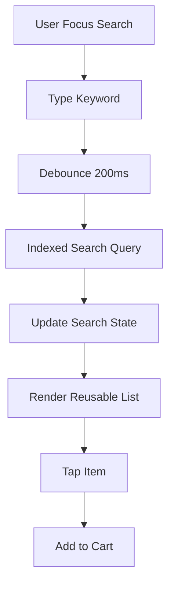
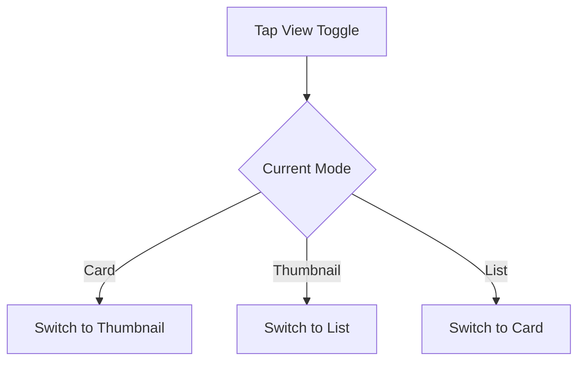
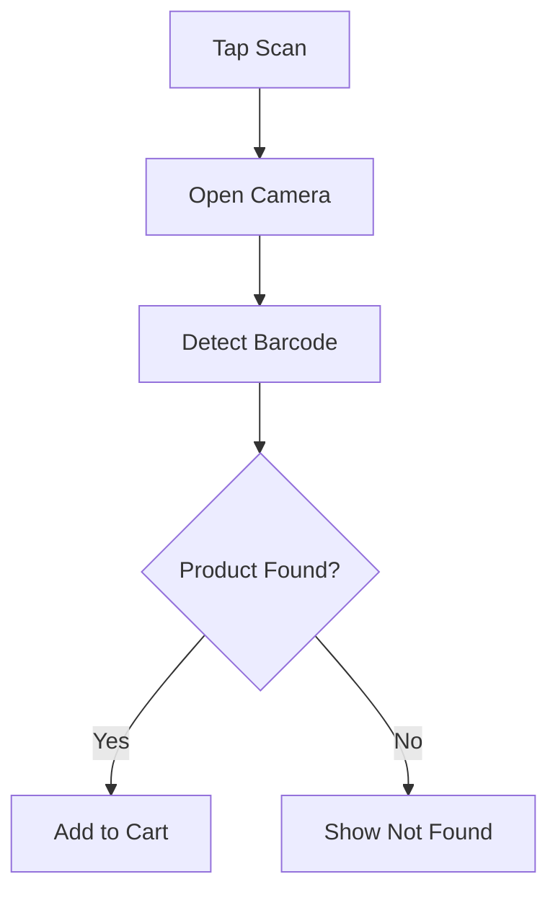
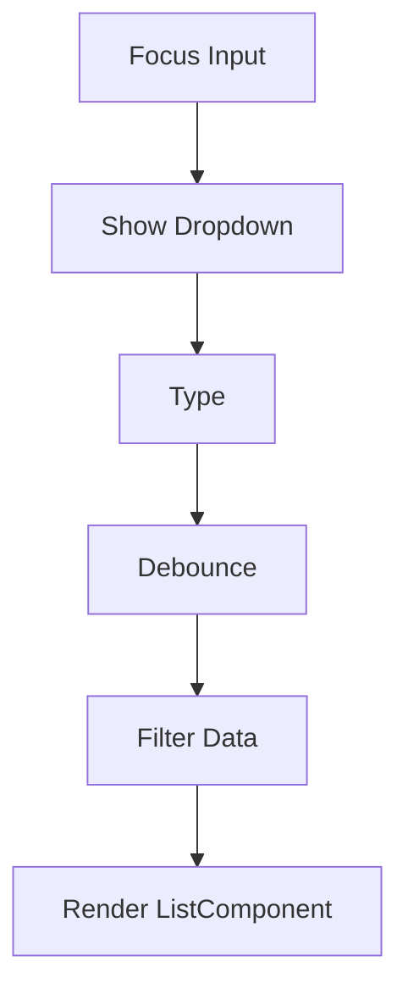

Berikut adalah **Flow & Wireframe Desain Pencarian Cashier (Responsive: Desktop, Tablet, Mobile)** dengan:

- Split layout (tablet & desktop)
- Mobile chart/cart mode
- Popup auto-complete (non-dialog, anchored dropdown)
- Toggle mode: List / Thumbnail / Card
- Tombol Scan sejajar input
- Reusable List Component (untuk autocomplete & main listing)
- Optimized performance (memoize, virtualization)
- Tanpa dialog/modal untuk auto-complete (hindari UI jump)

---

# 🎯 DESIGN PRINCIPLES

### 1️⃣ Zero Context Switch  
Autocomplete tidak boleh mengubah layout utama.

### 2️⃣ One Reusable List Component  
Digunakan untuk:
```text
- Product listing (POS)
- Search result
- Autocomplete dropdown
```

### 3️⃣ Performance First  
- Debounced search
- Indexed DB query
- Virtualized list
- Memoized item renderer
- Stable key extractor

---

# 🧱 GLOBAL SEARCH FLOW



---

# 🔍 SEARCH COMPONENT ARCHITECTURE

```text
<SearchBar>
   ├── Input Field
   ├── Scan Button
   └── AutoCompleteDropdown (absolute positioned)

<ProductList>
   └── ReusableListComponent
```

---

# 🖥 DESKTOP MODE (≥1024px)

## 🧩 Layout: Split Layout

```text
---------------------------------------------------------
| SEARCH BAR (Input + Scan + Toggle View)              |
---------------------------------------------------------
| PRODUCT GRID (Left 70%) | CART (Right 30%)           |
|                          |                            |
|  Card Mode (Default)     |  Active Cart               |
|                          |                            |
---------------------------------------------------------
```

---

## 🖥 DESKTOP – SEARCH BAR WIREFRAME

```text
---------------------------------------------------------
[ 🔍 Search product...            ] [📷 Scan] [☰ View]
---------------------------------------------------------
```

View toggle:
```text
☰ Options:
- List
- Thumbnail
- Card (default)
```

---

## 🖥 DESKTOP – AUTOCOMPLETE (NON-DIALOG)

Dropdown anchored to search input:

```text
---------------------------------------------------------
[ 🔍 Coca                              ] [📷]
---------------------------------------------------------
| Coca Cola 330ml       Rp 5.000      |
| Coca Cola 1L          Rp 9.000      |
| Coca Cola Zero        Rp 5.500      |
---------------------------------------------------------
```

⚠ Bukan dialog/modal  
Position: `absolute`, width mengikuti input.

---

# 📱 TABLET MODE (768–1024px)

Default:
- Split layout
- Card mode

```text
---------------------------------------------------------
| Search + Scan + Toggle                               |
---------------------------------------------------------
| Product Cards (60%) | Cart (40%)                     |
---------------------------------------------------------
```

---

# 📱 MOBILE MODE (<768px)

## 🧩 Layout: Toggle Mode (Product / Cart)

Default product listing mode:
→ Thumbnail mode

---

## 📱 MOBILE – PRODUCT VIEW

```text
------------------------------------------------
[ 🔍 Search product... ] [📷]
------------------------------------------------
| 🥤  Coca Cola 330ml   Rp 5.000              |
| 🥤  Fanta 330ml       Rp 5.000              |
| ☕  Cappuccino         Rp 18.000             |
------------------------------------------------
[ 🛒 View Cart (3) ]
------------------------------------------------
```

---

## 📱 MOBILE – CART VIEW

```text
------------------------------------------------
| Cart                                        |
------------------------------------------------
| Coca Cola x2     Rp 10.000                 |
| Cappuccino x1    Rp 18.000                 |
------------------------------------------------
Total: Rp 28.000
[ Checkout ]
------------------------------------------------
```

---

# 🧠 REUSABLE LIST COMPONENT DESIGN

Digunakan untuk:
- Autocomplete
- Main product listing
- Category filtering

---

## Component Props

```text
<ListComponent
    data
    mode = list | thumbnail | card
    onItemPress
    isVirtualized
/>
```

---

# 🧾 LIST MODE

```text
----------------------------------
| Coca Cola         Rp 5.000     |
----------------------------------
```

Ultra lightweight, fastest.

---

# 🖼 THUMBNAIL MODE (Mobile Default)

```text
----------------------------------
| 🥤 | Coca Cola 330ml           |
|     Rp 5.000                   |
----------------------------------
```

Balanced visual + performance.

---

# 🪟 CARD MODE (Tablet/Desktop Default)

```text
-------------------------
|  Image                |
|  Coca Cola 330ml      |
|  Rp 5.000             |
-------------------------
```

Grid layout.

---

# 🔁 VIEW TOGGLE FLOW



Persist view preference in local storage.

---

# 📷 SCAN BARCODE FLOW

Tombol sejajar input.

```text
[ 🔍 Search ... ] [📷]
```

Flow:



---

# ⚡ PERFORMANCE STRATEGY

---

## 1️⃣ Indexed Search

On DB setup:

```text
CREATE INDEX idx_product_name
CREATE INDEX idx_barcode
CREATE INDEX idx_sku
```

---

## 2️⃣ Debounce

```text
Search delay: 200ms
```

Prevents excessive query.

---

## 3️⃣ Memoized Renderer

```text
const ProductItem = React.memo(...)
```

Only re-render changed items.

---

## 4️⃣ Virtualized List

Use:
- FlatList (React Native)
- react-window / react-virtualized (web)

---

## 5️⃣ Stable Keys

```text
key = product.id
```

Avoid index key.

---

## 6️⃣ Avoid Layout Reflow

Autocomplete:
- Absolute positioned
- Same list component
- No modal mount/unmount animation

---

# 🧠 AUTOCOMPLETE FLOW DETAIL

---

## When User Types



---

## When User Blur

Delay 100ms before hide:
→ Allow item tap

---

# 🧩 COMPONENT HIERARCHY

```text
POSScreen
 ├── SearchBar
 │     ├── Input
 │     ├── ScanButton
 │     └── AutoCompleteDropdown
 │            └── ReusableList
 ├── ProductList
 │     └── ReusableList
 └── CartPanel
```

---

# 🧭 STATE MANAGEMENT

```text
searchQuery
filteredProducts
viewMode
isDropdownVisible
deviceType
```

Memoize:

```text
useMemo(filteredProducts)
useCallback(onItemPress)
```

---

# 🚫 WHAT WE AVOID

❌ Dialog modal for autocomplete  
❌ Full screen navigation on search  
❌ Heavy re-render grid  
❌ Re-query without debounce  
❌ Layout jump between search and list  

---

# 🎯 FINAL UX SUMMARY

| Device | Layout | Default View |
|---------|--------|--------------|
| Mobile | Toggle (Product/Cart) | Thumbnail |
| Tablet | Split Layout | Card |
| Desktop | Split Layout | Card |

Autocomplete:
- Non-dialog
- Anchored dropdown
- Reusable list component
- Smooth & responsive

Scan button:
- Inline with search
- Instant open

Performance:
- Indexed DB
- Debounce 200ms
- Virtualized list
- Memoized renderer
- Stable key

---
