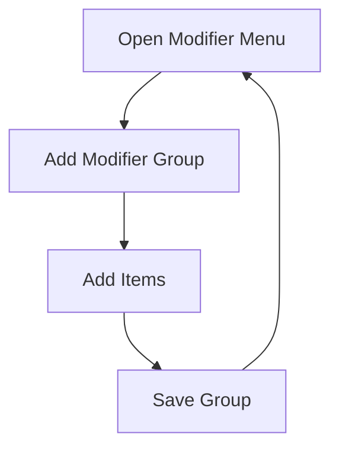
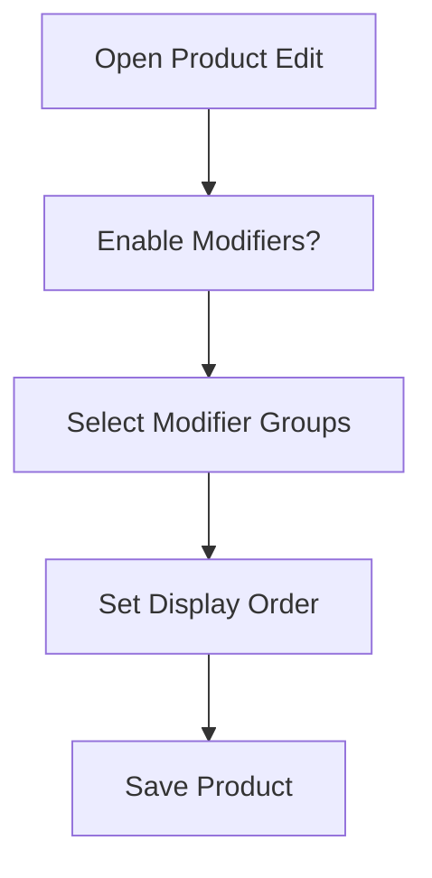
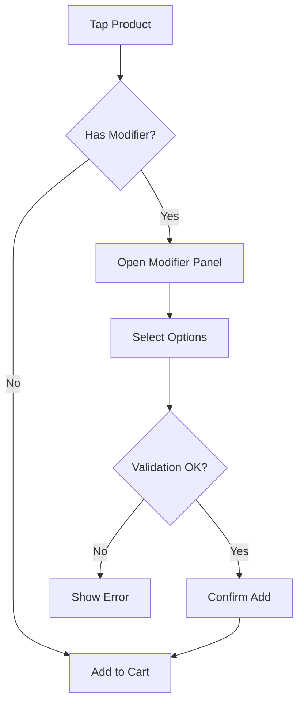
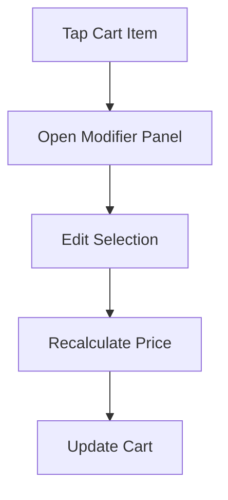

Berikut adalah **Modifier Flow & Wireframe Lengkap** mencakup:

- Modifier System Architecture  
- Flow di Product Management  
- Flow di Cashier (POS)  
- Validation Rules  
- Wireframe (Desktop / Tablet / Mobile)  
- Data Model & Pricing Logic  
- Performance & UX Considerations  

Dirancang untuk:
- Café / Coffee Shop / Restaurant heavy modifier
- Bisa tetap dipakai retail (optional add-on)
- Offline-first
- High-speed cashier experience
- Immutable transaction snapshot

---

# 🎯 MODIFIER SYSTEM GOAL

Modifier digunakan untuk:

```text
- Topping (cheese, boba, whipped cream)
- Sugar level
- Ice level
- Add-ons (extra shot, syrup)
- Cooking preference (rare, medium, well-done)
```

Modifier harus:
- Flexible (min/max selection)
- Required/optional
- Price-adjustable
- Fast selection
- Immutable after payment

---

# 🧱 DATA STRUCTURE

---

## 1️⃣ Modifier Group

```text
modifier_groups
- id
- name
- required (boolean)
- min_select
- max_select
- is_active
```

---

## 2️⃣ Modifier Items

```text
modifier_items
- id
- group_id
- name
- additional_price
- is_default (optional)
- is_active
```

---

## 3️⃣ Product Modifier Mapping

```text
product_modifier_groups
- id
- product_id
- group_id
- order_index
```

---

## 4️⃣ Cart Snapshot

```text
cart_item_modifiers
- cart_item_id
- modifier_group_name_snapshot
- modifier_item_name_snapshot
- additional_price_snapshot
```

Snapshot penting untuk audit.

---

# 🏗 PART 1 — PRODUCT SIDE FLOW

---

# 📌 FLOW: ADD MODIFIER GROUP



---

# 🖥 WIREFRAME – MODIFIER GROUP LIST

```text
------------------------------------------------
|              MODIFIER GROUPS                |
------------------------------------------------

[ + ADD GROUP ]

-----------------------------------------------
| Sugar Level         Required 1–1           |
| Ice Level           Required 1–1           |
| Toppings            Optional 0–3           |
-----------------------------------------------
```

---

# 🖥 ADD / EDIT MODIFIER GROUP

```text
------------------------------------------------
|           ADD MODIFIER GROUP                |
------------------------------------------------

Group Name:
[ Sugar Level ]

Required?
[ ✓ ]

Min Selection:
[ 1 ]

Max Selection:
[ 1 ]

-----------------------------------------------
[ SAVE ]
------------------------------------------------
```

---

# 🖥 ADD MODIFIER ITEMS

```text
------------------------------------------------
|           MODIFIER ITEMS                    |
------------------------------------------------

Group: Sugar Level

-----------------------------------------------
| Normal            +0                       |
| Less Sugar        +0                       |
| No Sugar          +0                       |
-----------------------------------------------

[ + ADD ITEM ]
```

---

# 📌 FLOW: ASSIGN MODIFIER TO PRODUCT



---

# 🖥 PRODUCT EDIT – MODIFIER SECTION

```text
------------------------------------------------
|               PRODUCT EDIT                  |
------------------------------------------------

Enable Modifiers?
[ ✓ ]

Modifier Groups:
-----------------------------------------------
[ ✓ ] Sugar Level
[ ✓ ] Ice Level
[ ✓ ] Toppings
-----------------------------------------------

[ SAVE PRODUCT ]
```

---

# 🧾 PRODUCT SIDE RULES

- Cannot assign inactive modifier group
- If group.required = true → must validate in POS
- Modifier group reusable across products

---

# 🛒 PART 2 — CASHIER SIDE FLOW

---

# 🎯 GOAL

Modifier selection harus:
- Cepat
- Tidak bikin blocking lama
- Tidak bikin layout lompat
- Validasi jelas

---

# 📌 FLOW: ADD PRODUCT WITH MODIFIER



---

# 🖥 DESKTOP / TABLET (SPLIT MODE)

## Modifier Panel → Side Drawer (Right)

```text
---------------------------------------------------------
| PRODUCT LIST           |   MODIFIER PANEL            |
|                         |-----------------------------|
| Cappuccino              | Sugar Level (Required)     |
|                         | (•) Normal                 |
|                         | ( ) Less Sugar             |
|                         | ( ) No Sugar               |
|                         |-----------------------------|
|                         | Ice Level (Required)       |
|                         | (•) Normal                 |
|                         |-----------------------------|
|                         | Toppings (0–3)             |
|                         | [ ] Cheese +2.000          |
|                         | [ ] Boba   +3.000          |
|                         |-----------------------------|
|                         | [ CANCEL ] [ ADD ]         |
---------------------------------------------------------
```

No modal dialog.

---

# 📱 MOBILE MODE

Full-height slide-up panel (NOT dialog).

```text
------------------------------------------------
| Cappuccino                                  |
------------------------------------------------
Sugar Level *
(•) Normal
( ) Less Sugar
( ) No Sugar

-----------------------------------------------
Ice Level *
(•) Normal
( ) Less Ice
( ) No Ice

-----------------------------------------------
Toppings (0–3)
[ ] Cheese +2.000
[ ] Boba   +3.000

-----------------------------------------------
Total: Rp 18.000
[ CANCEL ]     [ ADD ]
------------------------------------------------
```

---

# 🧠 PRICE CALCULATION LOGIC

---

## Final Unit Price

```text
final_price =
base_price
+ sum(selected_modifier.additional_price)
```

---

## Cart Subtotal

```text
subtotal = final_price × qty
```

---

# ✅ VALIDATION LOGIC

---

## Required Group

```text
If required = true AND selected_count < min_select
→ Block add
```

---

## Max Selection

```text
If selected_count > max_select
→ Disable further selection
```

---

## Real-time Feedback

Show error inline:

```text
⚠ Please select 1 Sugar Level
```

---

# 🛒 CART DISPLAY WITH MODIFIER

---

## 🖥 Desktop

```text
-----------------------------------------
Cappuccino x1     Rp 21.000
  - Less Sugar
  - Boba +3.000
-----------------------------------------
```

---

## 📱 Mobile

```text
Cappuccino
  Less Sugar
  Boba
Rp 21.000
```

---

# 🔁 EDIT MODIFIER IN CART

Flow:



---

# 🔒 AFTER PAYMENT

- Modifier snapshot stored
- Cannot edit
- If void → reverse entry

---

# ⚡ PERFORMANCE OPTIMIZATION

---

## 1️⃣ Memoize Modifier Panel

```text
React.memo(ModifierPanel)
```

---

## 2️⃣ Preload Modifier Data

Load once when product list loaded.

---

## 3️⃣ Avoid Re-render Product List

Modifier state separate from product state.

---

## 4️⃣ No Dialog Mount/Unmount

Use:
- Side panel
- Absolute overlay
- Slide animation only

---

# 🧩 COMPONENT STRUCTURE

```text
POSScreen
 ├── ProductList
 ├── ModifierPanel
 │     ├── ModifierGroup
 │     └── ModifierItem
 ├── CartPanel
```

State:

```text
activeProduct
selectedModifiers
validationState
```

---

# 🧾 EDGE CASE HANDLING

---

## ❗ Remove Modifier Group After Product Used

→ Soft delete only

---

## ❗ Change Modifier Price Later

Old transactions unaffected (snapshot used)

---

## ❗ Modifier Required but No Option Selected

Block Add button

---

# 🧠 UX MICRO-INTERACTION

- Default selected if is_default = true
- Checkbox ripple feedback
- Add button disabled until valid
- Show dynamic total

---

# 🎯 COMPLETE MODIFIER LIFECYCLE

```text
Create Modifier Group
→ Add Modifier Items
→ Assign to Product
→ Product Selected in POS
→ Modifier Panel Open
→ User Select Options
→ Validate Rules
→ Calculate Final Price
→ Add to Cart
→ Snapshot on Payment
→ Immutable Record
```

---

# ✅ FINAL RESULT

Modifier system akan:

- Mendukung café heavy customization
- Tetap ringan untuk retail
- Tidak mengganggu layout
- Tidak menggunakan dialog
- Responsive di mobile & desktop
- Audit-ready via snapshot
- Performant dengan memoization

---
