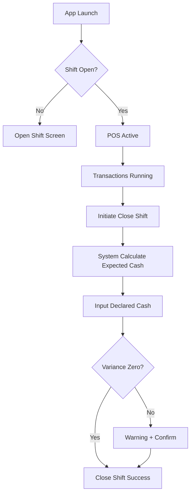
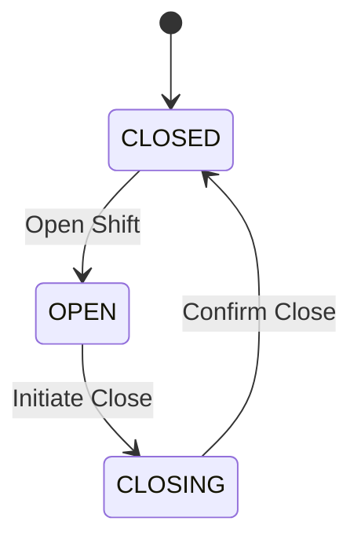

Berikut adalah **desain Shift System (Open–Close Shift) lengkap** mencakup:

1. Konsep kontrol internal  
2. Flow sistem (happy path + edge case)  
3. State machine  
4. Wireframe low-fidelity (text layout)  
5. Validasi & audit layer  

Dirancang untuk:
- Single device  
- No login  
- Cash only  
- Offline-first  
- Audit-ready  

---

# 🎯 TUJUAN SHIFT SYSTEM

Shift system berfungsi sebagai:

- Kontrol kas harian
- Pembatas transaksi
- Audit trail finansial
- Rekonsiliasi kas (expected vs declared)
- Pencegah manipulasi data

---

# 🧠 PRINCIPLE DESIGN

Shift adalah **financial container**.

Semua transaksi harus:
```
Transaction.shift_id = ACTIVE_SHIFT_ID
```

Jika tidak ada shift terbuka:
→ POS tidak boleh digunakan.

---

# 🗺 GLOBAL SHIFT FLOW



---

# 1️⃣ OPEN SHIFT FLOW

## 📌 Kapan Muncul?
- Pertama kali app dibuka
- Setelah shift sebelumnya ditutup

---

## 🟢 OPEN SHIFT – FLOW DETAIL

1. User buka app
2. System cek:
   ```
   SELECT * FROM shifts WHERE status = 'OPEN'
   ```
3. Jika tidak ada → tampil Open Shift Screen
4. User input:
   - Opening Cash
5. Confirm
6. System:
   - Insert shift record
   - status = OPEN
   - opened_at = now()

---

## 🧾 OPEN SHIFT DATA STRUCTURE

```
Shift:
- id
- opened_at
- opening_cash
- total_sales = 0
- expected_cash = opening_cash
- status = OPEN
```

---

# 🖥 OPEN SHIFT – WIREFRAME

```
------------------------------------------------
|              OPEN SHIFT                      |
------------------------------------------------

Opening Cash (Rp)
[  __________________________  ]

-----------------------------------------------
Expected to start new sales session.

[  START SHIFT  ]

-----------------------------------------------
Note:
All transactions will be recorded under this shift.
------------------------------------------------
```

---

## 🔒 Validation Rules

- Opening cash ≥ 0
- Tidak bisa buka shift jika shift sebelumnya belum ditutup
- Tidak bisa edit opening cash setelah submit

---

# 2️⃣ ACTIVE SHIFT BEHAVIOR

Saat shift OPEN:

- POS aktif
- Semua transaksi linked ke shift
- Expected cash updated live

---

## 💰 Expected Cash Formula

```
Expected Cash =
Opening Cash
+ Total Sales
- Total Void
```

Karena cash-only, tidak ada payment method lain.

---

# 3️⃣ CLOSE SHIFT FLOW

---

## 🔴 Initiate Close Shift

User klik:
```
Close Shift
```

System lakukan:

1. Calculate:
   - Total sales
   - Total tax
   - Total void
   - Expected cash
2. Lock POS screen (no new transaction)

---

# 🖥 CLOSE SHIFT – STEP 1 (SUMMARY)

```
------------------------------------------------
|               CLOSE SHIFT                    |
------------------------------------------------

Opening Cash:        Rp 500.000
Total Sales:         Rp 3.250.000
Total Void:          Rp 150.000
-----------------------------------------------
Expected Cash:       Rp 3.600.000

-----------------------------------------------

[ CONTINUE TO DECLARE CASH ]
------------------------------------------------
```

---

# 🔴 STEP 2 – DECLARE CASH

User menghitung uang fisik.

---

## 🖥 DECLARE CASH – WIREFRAME

```
------------------------------------------------
|             DECLARE CASH                     |
------------------------------------------------

Expected Cash:
Rp 3.600.000

Counted Cash (Rp):
[  __________________________ ]

-----------------------------------------------
Variance:
Rp 0

-----------------------------------------------
[  CONFIRM CLOSE SHIFT  ]
------------------------------------------------
```

---

# 🧮 Variance Formula

```
Variance = Declared Cash - Expected Cash
```

---

# ⚠ EDGE CASE: VARIANCE ≠ 0

Jika variance ≠ 0:

System tampilkan warning:

```
⚠ CASH DIFFERENCE DETECTED

Variance: Rp -50.000

Please confirm.
```

Button:
- Back
- Confirm Anyway

---

# 🔒 FINALIZE CLOSE SHIFT

System:

1. Update shift:
   - closed_at
   - declared_cash
   - variance
   - status = CLOSED
2. Lock all transactions under shift
3. Generate shift summary report
4. Redirect ke Open Shift screen

---

# 4️⃣ SHIFT STATE MACHINE



---

# 5️⃣ DATA INTEGRITY RULES

## 🔐 Immutable Policies

- Tidak bisa delete shift
- Tidak bisa edit shift setelah closed
- Tidak bisa tambah transaksi setelah close
- Tidak bisa close shift jika ada pending cart

---

# 6️⃣ SHIFT EDGE CASE FLOW

---

## ❗ Case 1 – App Crash

Saat app dibuka:
- Jika shift OPEN
→ resume shift

---

## ❗ Case 2 – Pending Cart Exists

Saat close shift:
```
IF pending cart > 0
→ Block close shift
→ Show list
```

---

## ❗ Case 3 – Zero Transaction Shift

Boleh ditutup.
Expected cash = opening cash.

---

# 7️⃣ ADVANCED CONTROL (OPTIONAL BUT RECOMMENDED)

---

## 🧾 Shift Audit Summary Screen

Setelah close:

```
------------------------------------------------
|           SHIFT SUMMARY                      |
------------------------------------------------

Shift ID: #20260223-01
Duration: 8h 12m
Transactions: 125
Total Sales: Rp 3.250.000
Void: Rp 150.000
Expected: Rp 3.600.000
Declared: Rp 3.550.000
Variance: Rp -50.000

-----------------------------------------------
[ EXPORT PDF ]
[ DONE ]
------------------------------------------------
```

---

# 8️⃣ DATABASE FLOW (SHIFT + TRANSACTION LINK)

```
Transaction
    ↓
Linked to shift_id
    ↓
Shift aggregates transaction totals
```

---

# 9️⃣ UX DESIGN PRINCIPLES

### ✅ Simple
Kasir hanya input:
- Opening cash
- Declared cash

### ✅ Transparent
Semua angka terlihat jelas.

### ✅ Non-editable
Tidak ada tombol edit setelah confirm.

### ✅ Safe
Close shift memblokir transaksi.

---

# 🔟 SECURITY SIMPLIFICATION (NO LOGIN MODE)

Karena no login:
- Device-level control
- Optional: PIN untuk Close Shift
- Optional: PIN untuk Void

---

# 1️⃣1️⃣ COMPLETE SHIFT LIFECYCLE

```
App Launch
→ No Open Shift
→ Open Shift (input beginning balance)
→ POS Active
→ Transactions
→ Close Shift Initiated
→ System Calculate Expected
→ User Declare Cash
→ Variance Calculated
→ Confirm Close
→ Shift Locked
→ New Shift Ready
```

---

# 🎯 FINAL RESULT

Shift system Anda akan:

- Audit-ready
- Cash-reconciliation capable
- Immutable
- Financially accurate
- Aman untuk single device
- Cocok untuk cafe & retail

---

Jika Anda ingin, saya bisa lanjut ke:

- 🔹 Desain database query real-time aggregation shift
- 🔹 UI High-fidelity layout structure
- 🔹 Flow khusus cafe (table-based shift)
- 🔹 Flow khusus retail high-volume
- 🔹 Risk analysis & fraud prevention model
- 🔹 Diagram arsitektur internal cash control engine

Pilih arah berikutnya.