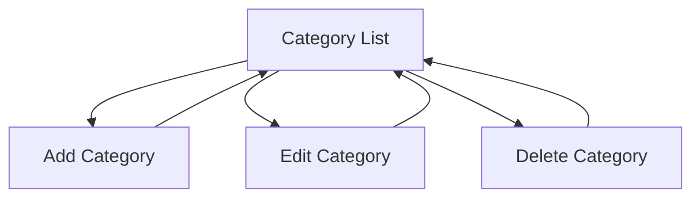
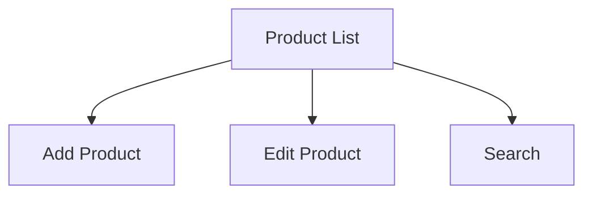
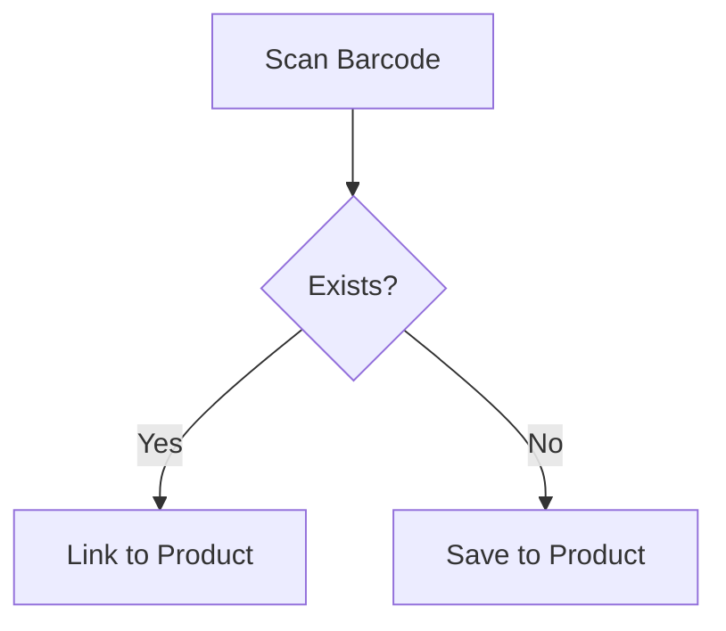
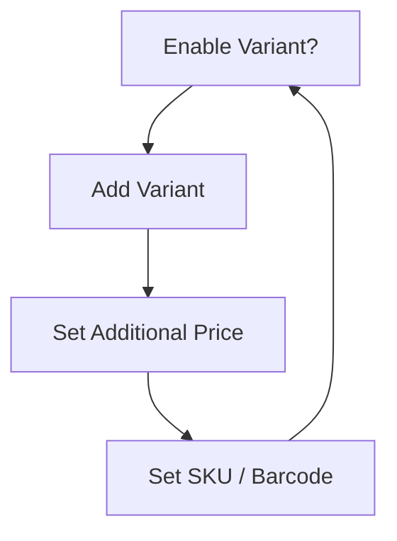
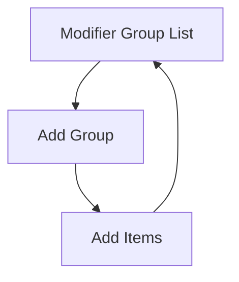
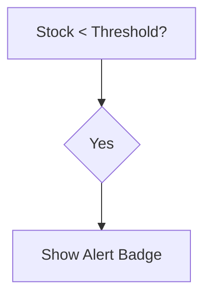

Berikut adalah **Flow & Wireframe Lengkap (Text Markdown)** untuk:

- Product Management  
- Stock Management  
- Categories  
- Modifier Groups  
- Variants  
- Barcode/QR Code (scan + generate)  
- Handling Retail + Café + Restaurant (non-retail products)

Dirancang untuk:
- Single device  
- Offline-first  
- SQLite  
- Audit-ready  
- Multi-type business (retail & F&B)

---

# 🎯 DESIGN PRINCIPLE

Kita pisahkan logika menjadi dua tipe produk:

```text
RETAIL PRODUCT
- Biasanya punya barcode
- Track stock per unit
- Bisa punya variant (size, warna)

NON-RETAIL (F&B)
- Biasanya tanpa barcode
- Bisa track stock bahan baku
- Bisa pakai modifier (topping, sugar level, dll.)
```

---

# 🧱 GLOBAL MODULE STRUCTURE

```text
Product Management
 ├── Categories
 ├── Products
 │     ├── Variants
 │     ├── Modifiers
 │     ├── Barcode / QR
 └── Stock Management
```

---

# 1️⃣ CATEGORY MANAGEMENT

---

## 📌 CATEGORY FLOW



---

## 🖥 CATEGORY LIST – WIREFRAME

```text
------------------------------------------------
|               CATEGORIES                     |
------------------------------------------------

[ + ADD CATEGORY ]

-----------------------------------------------
| ☕ Beverages                  (15 items)    |
| 🍰 Desserts                   (8 items)     |
| 🥤 Retail Drinks              (20 items)    |
| 🧴 Household                  (45 items)    |
-----------------------------------------------

[ Back ]
------------------------------------------------
```

---

## 🖥 ADD / EDIT CATEGORY

```text
------------------------------------------------
|             ADD CATEGORY                     |
------------------------------------------------

Category Name:
[ __________________________ ]

Icon (optional):
[ Select Icon ]

-----------------------------------------------
[ SAVE ]
------------------------------------------------
```

---

## 🔒 RULES

- Cannot delete category if products exist
- Soft delete recommended (is_active flag)

---

# 2️⃣ PRODUCT MANAGEMENT FLOW

---

# 🛍 PRODUCT TYPE LOGIC

```text
Product Type:
( ) Retail Product
( ) Food & Beverage
```

This selection changes UI behavior.

---

# 📦 PRODUCT LIST FLOW



---

## 🖥 PRODUCT LIST – WIREFRAME

```text
------------------------------------------------
|               PRODUCTS                       |
------------------------------------------------

[ + ADD PRODUCT ]    [ Search 🔍 ]

-----------------------------------------------
| Coca Cola 330ml      Rp 5.000   Stock: 120 |
| Cappuccino           Rp 18.000  -           |
| Indomie Goreng       Rp 3.500   Stock: 200 |
-----------------------------------------------

Tap to edit
------------------------------------------------
```

---

# 3️⃣ ADD / EDIT PRODUCT FLOW

---

## 🖥 STEP 1 – BASIC INFO

```text
------------------------------------------------
|             ADD PRODUCT                      |
------------------------------------------------

Product Type:
(•) Retail Product
( ) Food & Beverage

Product Name:
[ __________________________ ]

Category:
[ Select Category ▼ ]

Base Price:
[ __________________________ ]

Cost Price:
[ __________________________ ]

-----------------------------------------------
[ NEXT ]
------------------------------------------------
```

---

## 🖥 STEP 2 – STOCK CONFIG

IF Retail Product:

```text
Track Stock:
[ ✓ ]

Initial Stock:
[ __________ ]

Low Stock Alert:
[ __________ ]
```

IF F&B:

```text
Track Stock:
[ Optional ✓ ]

If enabled:
- Track finished product
OR
- Link to ingredient system (future)
```

---

# 4️⃣ BARCODE / QR MANAGEMENT

---

# 📦 Retail Product (Barcode-Based)

---

## 🖥 STEP 3 – BARCODE

```text
------------------------------------------------
|          BARCODE CONFIGURATION               |
------------------------------------------------

Existing Barcode?
(•) Yes
( ) No

If Yes:
[ Scan Barcode ]
[ Enter Manually ]

If No:
[ Generate Barcode ]
[ Generate QR Code ]

-----------------------------------------------
Generated Code:
1234567890123

[ SAVE PRODUCT ]
------------------------------------------------
```

---

## 🔄 BARCODE FLOW



---

## 🔐 RULES

- Barcode must be unique
- Prevent duplicate barcode
- QR code optional

---

# 🧾 QR CODE GENERATION (Non-Retail Allowed)

For café menu items:

- Generate internal QR
- Used for:
  - Faster selection
  - Kitchen routing (future)
  - Table ordering (future-ready)

---

# 5️⃣ VARIANT MANAGEMENT

---

# 📌 WHEN USED?

Retail:
- Size
- Color
- Package type

F&B:
- Size (Small/Medium/Large)

---

## 🖥 VARIANT FLOW



---

## 🖥 VARIANT UI

```text
------------------------------------------------
|               VARIANTS                       |
------------------------------------------------

[ ✓ Enable Variants ]

-----------------------------------------------
| Small        +0      Stock: 20              |
| Medium       +3.000  Stock: 30              |
| Large        +5.000  Stock: 15              |
-----------------------------------------------

[ + ADD VARIANT ]
------------------------------------------------
```

---

## 🔐 RULES

- Variant can have own barcode
- Variant can track stock independently
- If variant enabled → parent stock disabled

---

# 6️⃣ MODIFIER MANAGEMENT

---

# 📌 Used Mainly for F&B

Examples:
- Sugar Level
- Ice Level
- Toppings
- Add-ons

---

## 🖥 MODIFIER GROUP FLOW



---

## 🖥 ADD MODIFIER GROUP

```text
------------------------------------------------
|          ADD MODIFIER GROUP                  |
------------------------------------------------

Group Name:
[ Sugar Level ]

Required?
[ ✓ ]

Min Selection:
[ 1 ]

Max Selection:
[ 1 ]

-----------------------------------------------
[ SAVE ]
------------------------------------------------
```

---

## 🖥 MODIFIER ITEMS

```text
------------------------------------------------
|          MODIFIER ITEMS                      |
------------------------------------------------

Group: Sugar Level

-----------------------------------------------
| Normal         +0                           |
| Less Sugar     +0                           |
| No Sugar       +0                           |
-----------------------------------------------

[ + ADD ITEM ]
------------------------------------------------
```

---

## 🔐 RULES

- Required group must validate in cart
- Modifier price added to final unit price

---

# 7️⃣ STOCK MANAGEMENT FLOW

---

# 📦 RETAIL STOCK FLOW

---

## 🖥 STOCK DASHBOARD

```text
------------------------------------------------
|              STOCK MANAGEMENT                |
------------------------------------------------

[ Search Product ]

-----------------------------------------------
| Coca Cola 330ml      120    Low: 10        |
| Indomie Goreng       200    Low: 20        |
-----------------------------------------------

Tap to adjust
------------------------------------------------
```

---

## 🔧 MANUAL STOCK ADJUSTMENT

```text
------------------------------------------------
|         STOCK ADJUSTMENT                     |
------------------------------------------------

Current Stock: 120

Adjustment Type:
(•) Lost
( ) Damaged
( ) Correction
( ) Restock

Quantity:
[ ______ ]

Reason:
[ __________________________ ]

-----------------------------------------------
[ SAVE ]
------------------------------------------------
```

---

## 🔐 Adjustment Logic

```text
Insert StockMovement
Update product.stock_qty
```

Immutable log only.

---

# 8️⃣ F&B STOCK HANDLING

Karena non-retail:

Option 1:
Track finished goods (simpler)

Option 2 (advanced future):
Ingredient-based deduction

---

## 🖥 F&B STOCK SIMPLE

```text
Track Stock?
[ Optional ✓ ]

If enabled:
Initial stock:
[ ____ ]

Auto deduct per sale
```

---

# 9️⃣ LOW STOCK ALERT FLOW



UI:

```text
⚠ Low Stock:
- Coca Cola (5 left)
- Indomie (10 left)
```

---

# 🔟 COMPLETE PRODUCT LIFECYCLE

```text
Create Category
→ Create Product
→ Configure Type
→ Configure Stock
→ Add Barcode / Generate QR
→ Add Variant (optional)
→ Add Modifier (optional)
→ Save
→ Available in POS
→ Stock Deduct on Sale
→ Adjustment if needed
```

---

# 1️⃣1️⃣ EDGE CASE HANDLING

---

## ❗ Duplicate Barcode

Block save.

---

## ❗ Variant + Parent Stock Both Enabled

Disallow.

---

## ❗ Delete Product With Transactions

Soft delete only.

---

# 1️⃣2️⃣ DIFFERENCE: RETAIL vs CAFE FLOW SUMMARY

| Feature | Retail | Café |
|----------|--------|------|
| Barcode | Yes | Optional |
| QR | Optional | Yes |
| Variant | Size/Color | Size |
| Modifier | Rare | Core |
| Stock | Per unit | Optional |
| Ingredient | No | Future |

---

# 🎯 FINAL RESULT

Sistem akan:

- Support barcode-based retail
- Generate barcode/QR untuk produk internal
- Support café modifier-heavy flow
- Support variant-heavy retail
- Immutable stock tracking
- Flexible untuk small restaurant

---

